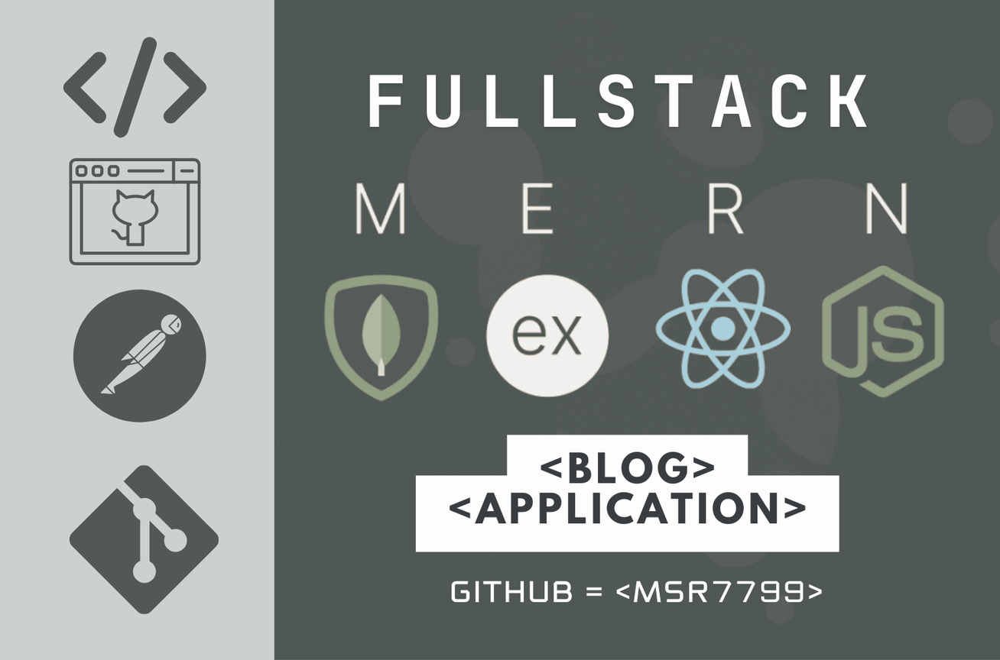

# 🚀 blog-pro-MERN-stack

- import 'bootstrap/dist/css/bootstrap.min.css';

- import 'bootswatch/dist/spacelab/bootstrap.min.css';

- import 'bootstrap-icons/font/bootstrap-icons.css';



## 📚 Usage

- Install Mongo DB on your local machine or use Mongo DB Cloud -> [Go To MongoDB Website](https://www.mongodb.com)

- Create Cloudinary account for storing the images -> [Go To Cloudinary Website](https://cloudinary.com/)

- Create `images` folder in the backend

## 🌐 Environment Variables

Create a `.env` file inside the backend folder and add the following:

```env
PORT= 5000
MONGO_URI= Your MongoDB database URL
NODE_ENV= development
JWT_SECRET= Your JWT secret key
CLOUDINARY_CLOUD_NAME= Your Cloudinary username
CLOUDINARY_API_KEY= Your Cloudinary API key
CLOUDINARY_API_SECRET= Your Cloudinary API secret
CLIENT_DOMAIN= http://localhost:3000 
```

## 📦 Install Dependencies

### 🔧 backend

```bash
Run the following command inside the backend folder:
cd backend
npm install
```

### 🎨 frontend

```bash
Run the following command inside the frontend folder:
cd frontend
npm install
npm install bootstrap-icons
```

## ▶️ Run

### 🚀 Run the backend

```bash
Run the following command to start the backend:
cd backend
npm run dev
```

### 🌐 Run the frontend

```bash
Run the following command to start the frontend:
cd frontend
npm start
```

## 📁 Project Structure

### 🔍 Click to View Full Project Structure

```bash
# 🌟 Root Directory
MERN-STACK-REACT-NODEJS/
├── 📘 README.md                            # Project documentation
│
├── 🚀 backend/                             # Backend (PORT:5000)
│   ├── .env                               # Environment variables
│   ├── .gitignore                         # Git ignore file
│   ├── app.js                             # Entry point
│   │
│   ├── 🔧 config/
│   │   ├── AdminToken.js                  # Admin token config
│   │   └── connectToDb.js                 # MongoDB connection
│   │
│   ├── 🎮 controllers/
│   │   ├── authController.js              # /api/auth/*
│   │   ├── categoriesController.js        # /api/categories/*
│   │   ├── commentsController.js          # /api/comments/*
│   │   ├── passwordController.js          # /api/password/*
│   │   ├── postsController.js             # /api/posts/*
│   │   └── usersController.js             # /api/users/*
│   │
│   ├── 🖼️ images/
│   │
│   ├── ⚡ middlewares/
│   │   ├── error.js                       # Error handling
│   │   ├── photoUpload.js                 # Image upload
│   │   └── validateObjectId.js            # Validate ObjectId
│   │
│   ├── 📊 models/
│   │   ├── Category.js                    # Category schema
│   │   ├── Comment.js                     # Comment schema
│   │   ├── Post.js                        # Post schema
│   │   └── User.js                        # User schema
│   │
│   ├── 🛣️ routes/
│   │   ├── authRoute.js                   # /api/auth
│   │   ├── categoriesRoute.js             # /api/categories
│   │   ├── commentsRoute.js               # /api/comments
│   │   ├── postsRoute.js                  # /api/posts
│   │   └── usersRoute.js                  # /api/users
│   │
│   └── 🛠️ utils/
│       └── cloudinary.js                  # Cloudinary config
│
├── 🎨 frontend/                           # Frontend (PORT:3000)
│   ├── .gitignore                        # Git ignore file
│   ├── package.json                      # Dependencies
│   │
│   ├── 🌐 public/
│   │   └── index.html                    # Entry HTML
│   │
│   └── 📱 src/
│       ├── components/
│       │   ├── header/
│       │   ├── posts/
│       │   └── sidebar/
│       │
│       ├── pages/
│       │   ├── admin/                    # Admin dashboard
│       │   ├── auth/                     # Authentication
│       │   ├── create-post/              # Post creation
│       │   ├── home/                     # Homepage
│       │   ├── post-details/             # Post view
│       │   └── profile/                  # User profile
│       │
│       ├── redux/
│       │   ├── apiCalls/                 # API interactions
│       │   ├── slices/                   # Redux slices
│       │   └── store.js                  # Redux store
│       │
│       └── utils/
│           └── request.js                # Axios config
```

</details>

### 🎯 Key Features by Directory

- **🔒 Backend**
  - `controllers/`: Business logic for all API endpoints
  - `models/`: MongoDB schema definitions
  - `routes/`: API route definitions
  - `middlewares/`: Custom middleware functions

- **💫 Frontend**
  - `components/`: Reusable React components
  - `pages/`: Main application views
  - `redux/`: State management
  - `utils/`: Helper functions and configurations

## 👥 User Features

## as a User I Can :-

### 📝 Posts Management

- Create new blog posts with images

- Edit and delete their own posts

- View all posts from other users

- Filter posts by categories

- Search for specific posts

### 💬 Comments System

- Add comments on any post

- Edit their own comments

- Delete their own comments

### 👤 User Profile

- Create and manage personal profile

### 🏷️ Categories

- Browse posts by categories

- Update personal information

### 🔐 Authentication

- Register new account

- View all available categories

### 👑 Admin Features

- Manage all users (view, delete)

- Reset password via email

- Logout from the system

### 🔍 Search & Filter

- Search posts by title or content

- Create and manage categories

### 📱 Responsive Design

- Fully responsive layout

- Search posts by title or content

- Filter posts by category

- Filter posts by date

- Sort posts by various criteria

- Access admin dashboard

- View site statistics

- Works on mobile devices

- Adapts to different screen sizes
